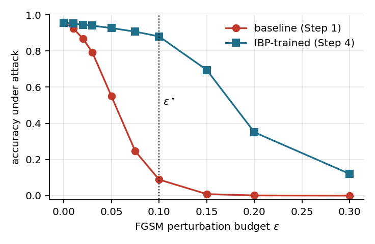
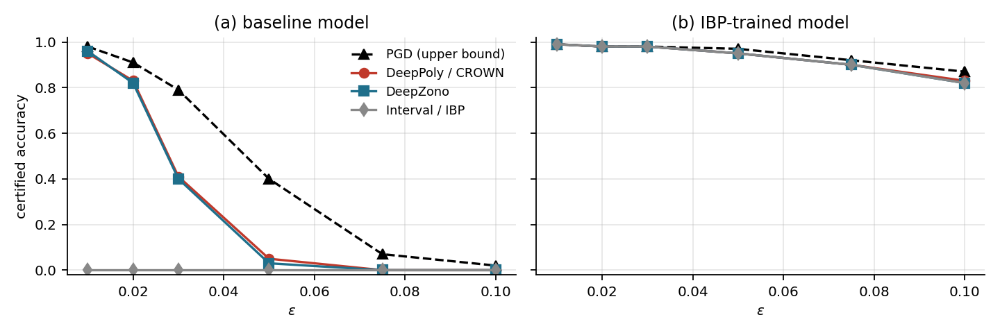

# Trustworthy AI Systems — Final Project

Adversarial attacks, formal verification and certified training of a small
`784 → 64 → 32 → 10` fully connected ReLU classifier on MNIST.

The project follows the six steps of the assignment:

1. **Train** a baseline MLP for two epochs.
2. **Attack** it with FGSM (and PGD) and show that it breaks.
3. **Verify** it formally and prove that it is not robust.
4. **Retrain** it with Interval Bound Propagation (IBP), a certified-training method.
5. **Re-attack** the certified model on exactly the images that fooled the baseline.
6. **Re-verify** the certified model.

Everything is written in **pure NumPy**: the network, backpropagation, Adam,
FGSM/PGD, IBP training and four verifiers (Interval, DeepZono, DeepPoly/CROWN
and a complete MILP verifier). No deep-learning framework or GPU is needed.

---

## Results (ε = 0.1, ℓ∞)

Numbers are taken from the files in [`results/`](results/).

| | baseline (Step 1) | IBP-trained (Step 4) |
|---|---|---|
| clean test accuracy | **95.87 %** | **95.59 %** |
| accuracy under FGSM | 8.87 % | **88.04 %** |
| accuracy under PGD-50 (3 restarts) | 3.16 % | **86.18 %** |
| IBP-certified accuracy, full test set | — | 82.89 % |

Formal verification on the first 100 test images:

| | baseline | IBP-trained |
|---|---|---|
| certified — Interval / IBP | 0 % | 82 % |
| certified — DeepZono | 0 % | 82 % |
| certified — DeepPoly / CROWN | 0 % | 83 % |
| **complete (MILP) verified** | **0 %** | **83 %** |
| falsified with an explicit counterexample | 97 | 16 |
| misclassified even without perturbation | 1 | 1 |
| undecided (30 s MILP timeout) | 2 | 0 |
| unstable ReLUs per input (mean, of 96) | 81.9 | 13.0 |

FGSM fooled **8,700** test images on the baseline. The certified model still
classifies **7,840 (90.11 %)** of them correctly when the attack is
re-crafted against it.

<p align="center">
  
  
</p>

> **Note on the report.** `report/report.pdf` was compiled from an earlier
> run of the same pipeline, so its numbers differ slightly from the table above
> (for example 95.77 % instead of 95.87 % baseline accuracy, and 82 % instead
> of 83 % complete-verified). The conclusions are the same. Rebuilding the
> report after `run_all.py` (see below) makes the report and `results/` agree.

---

## Repository layout

```
code/      all source code (pure NumPy)
data/      the four original MNIST IDX files (gzipped)
models/    trained weights: mlp_baseline.{npz,onnx}, mlp_ibp.{npz,onnx}
results/   step*.json metrics, fooled_samples.npz, mnist_test_eran.csv
results/figures/   every figure used in the report
report/    report.tex and the compiled PDF
```

### Source files

| file | contents |
|---|---|
| `code/config.py` | seed, paths and every hyper-parameter |
| `code/tas_lib.py` | MNIST loading, MLP, manual backprop, Adam, FGSM, PGD, IBP forward pass and its analytic gradients |
| `code/verifiers.py` | four verifiers: Interval, DeepZono (zonotope), DeepPoly/CROWN, complete MILP |
| `code/verification_driver.py` | the verification pipeline shared by Steps 3 and 6 |
| `code/step1_train_baseline.py` … `step6_verify_ibp.py` | the six assignment steps, in order |
| `code/run_all.py` | runs every step, the export and the figures end to end |
| `code/export_models.py` | ONNX export, onnxruntime check and the ERAN test CSV |
| `code/make_figures.py` | every figure in the report |
| `code/to_pytorch.py` | converts the NumPy weights to a PyTorch `.pth` state-dict |
| `code/run_autolirpa.py` | reproduces Steps 3/6 with the official CROWN tool (`auto_LiRPA`) |
| `code/run_eran.sh` | the ERAN commands (`deeppoly` / `deepzono`) for the ONNX models |

---

## Reproducing

```bash
pip install -r code/requirements.txt
cd code
python run_all.py                  # all six steps, ONNX export and figures
cd ../report
pdflatex report.tex && pdflatex report.tex   # run twice for cross-references
```

`run_all.py` runs on a single CPU core. Most of the time goes into IBP
training (150 epochs, about 15 minutes in the recorded run), so expect
roughly 15–20 minutes in total. Each step can also be run on its own, for
example `python step2_fgsm_attack.py`.

Everything is seeded (`seed = 1405` in `code/config.py`, where all
hyper-parameters live).

### Environment used

Ubuntu 24.04, single CPU core, no GPU.
Python 3.12.3 · NumPy 2.4.4 · SciPy 1.17.1 · Matplotlib 3.10.8 ·
ONNX 1.22.0 · ONNX Runtime 1.24.4.

### Cross-checking with the official tools (optional)

The results do not depend on these tools. They are only for comparison with
the reference implementations.

```bash
# CROWN / auto_LiRPA
pip install torch torchvision auto_LiRPA
cd code
python to_pytorch.py ../models/mlp_baseline.npz mlp_baseline.pth
python run_autolirpa.py mlp_baseline.pth 0.1

# ERAN (via the official Docker image)
docker pull ethsri/eran:cpu
# the exact commands are in code/run_eran.sh
```

The exported ONNX graphs were run with onnxruntime. Their logits match the
NumPy networks to within `7e-6` (`results/export_check.json`).

---

## Known limitation

Two baseline inputs (test indices 82 and 88) are **undecided** at ε = 0.1
within the 30 s MILP time limit: DeepPoly cannot certify them and PGD cannot
find a counterexample. They are reported as `TIMEOUT` rather than counted as
robust or not robust. Because they are only 2 of 100 inputs, the conclusion
is unaffected: the baseline's certified accuracy is between 0 % and 2 %,
compared with 83 % for the IBP-trained model.
